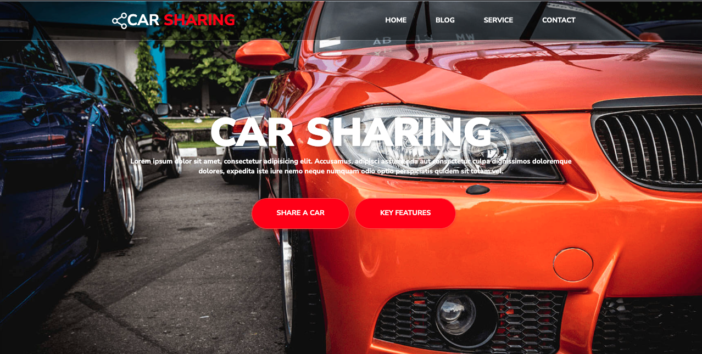
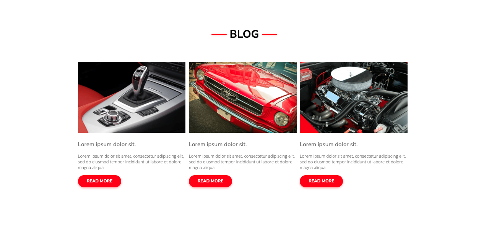
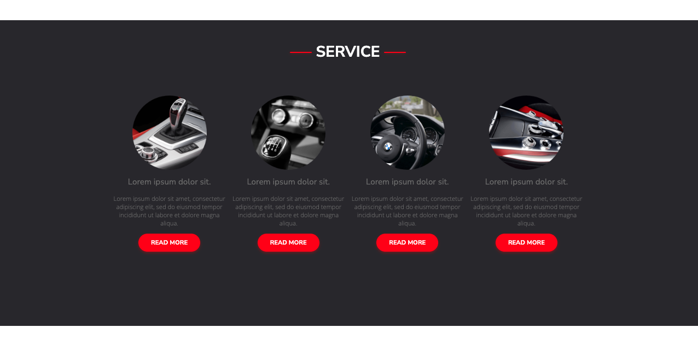
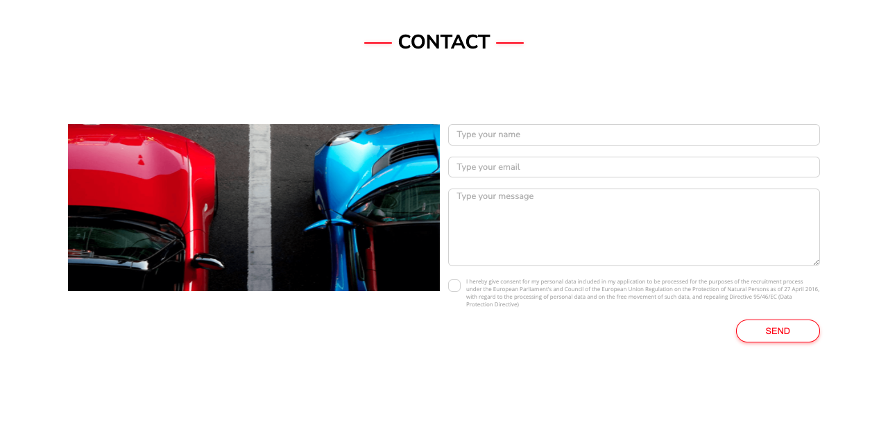

Best Shop website

Not responsive web design done on CL workshops

Te main purpose of the project is creating a not responsive website with use of HTML 5 and CSS, then converted to SCSS
in learning process. Use of all basics.

## Table of Contents

* [General Info](#general-information)
* [Technologies Used](#technologies-used)
* [Screenshots](#screenshots)
* [Setup](#setup)
* [Project Status](#project-status)
* [Room for Improvement](#room-for-improvement)
* [Contact](#contact)

## General Information

- Project created at CodersLab bootcamp
- Purpose was to learn how to simply build layouts
- Later project styling rewritten to SCSS

## Technologies Used

- HTML
- SCSS

## Screenshots

## Setup

- download or clone repository / `git clone repo_address`
- install dependencies / `npm install`
- start app by 'gulp'

## Project Status

Project is: no longer being worked on. Assumed learning task completed.

[//]: # (Assumed learning task completed.)

## Room for Improvement

- Contact section could be useable with validation and contact form.

## Contact

Created by [_Duckjaniels_](https://www.linkedin.com/in/maksym-kaczorowski-008b3a154/) - feel free to contact me!#

